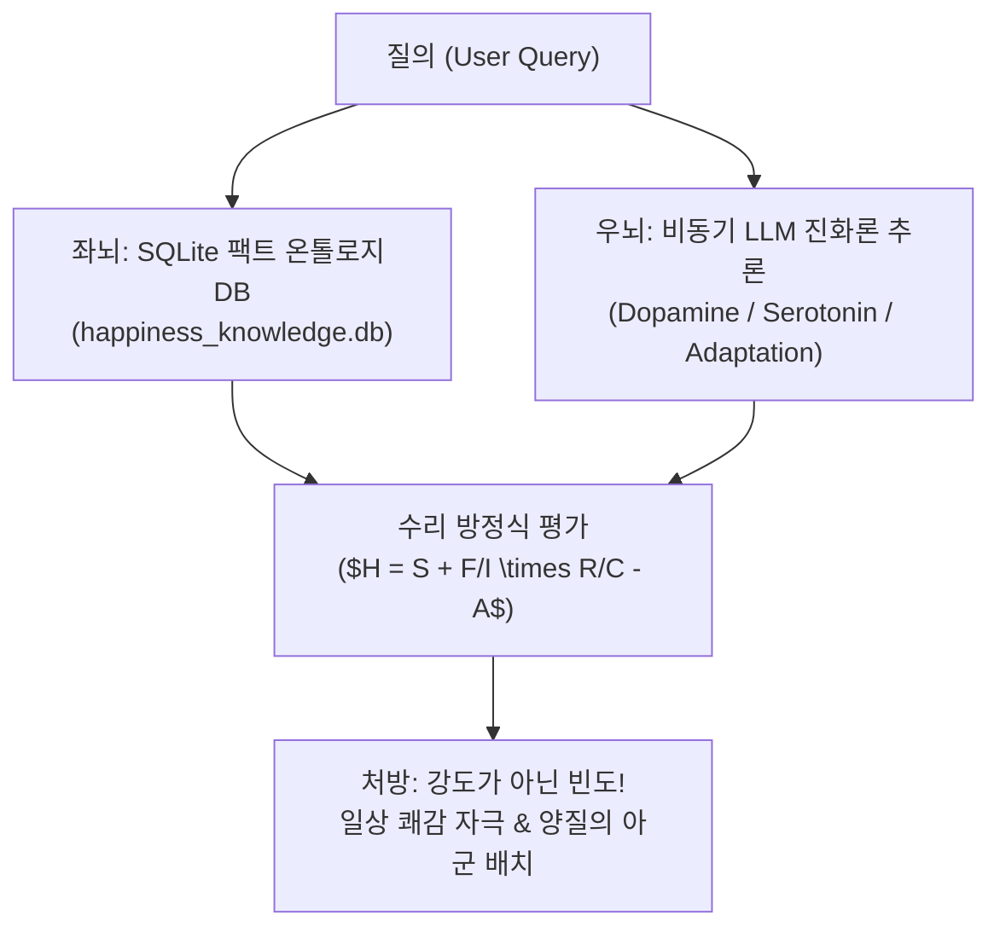

# 🌟 Happiness_ontology: Neurosymbolic AI Skill & Knowledge Container

[](#-neurosymbolic-architecture)
[](#-sqlite-database-schema)
[](#-responsible-ai--xai)
[](#-obsidian-style-knowledge-graph)

**Happiness_ontology**는 연세대학교 심리학과 서은국 교수의 《행복의 기원》 진화심리학·뇌과학 연구와 쌍둥이 행동유전학 수리 모델을 캡슐화한 **독립형 Neurosymbolic AI 에이전트 스킬 & 컨테이너 데이터베이스** 프로젝트입니다.

---

## 📌 1. 개요 및 핵심 철학 (Core Philosophy)

전통적 철학이 행복을 "마음먹기에 달린 관념적 목적"으로 보았던 것과 달리, 본 시스템은 행복을 **생존과 번식을 위해 뇌가 구동하는 생물학적 신호 체계(Signal System)**로 정밀 모델링합니다.



---

## 📐 2. 행복의 과학적 수리 방정식 (Mathematical Models)

### 1) 행복 종합 구동 방정식 ($H$)
$$\text{Happiness} (H) = S + \left( \frac{F_{\text{pleasure}}}{I_{\text{pleasure}}} \right) \times \left( \frac{R_{\text{quality}}}{C_{\text{isolation}}} \right) - A_{\text{adaptation}}$$

* **$S$ (Set Point, 유전적 외향성):** 행복 개인차의 40~50%를 결정하는 선천적 기준점.
* **$F_{\text{pleasure}} / I_{\text{pleasure}}$ (강도 대비 빈도비):** 로또 같은 대형 사건($I$)보다 소소한 경험의 자주 발생($F$)이 주동력.
* **$R_{\text{quality}} / C_{\text{isolation}}$ (고립 대비 아군 관계비):** 무조건적 아군 관계($R$) 강화 및 사회적 고립($C$) 축소.
* **$A_{\text{adaptation}}$ (정서적 적응 차감량):** 새로운 자극 감지를 위한 감정 리셋 소멸 요인.

### 2) 표현형 분산 분해 공식 ($V_P$)
$$V_P = \underbrace{V_G (\text{유전적 외향성})}_{\approx 50\%} + \underbrace{V_{\text{Chance}} (\text{살면서 겪는 우연})}_{\approx 45\%} + \underbrace{V_{\text{Effort}} (\text{의지/마음먹기})}_{< 5\%}$$

> **Key Takeaway:** "마음먹기"나 주관적 의지($V_{\text{Effort}}$)는 5% 미만에 불과하며, **우연히 즐거운 자극을 접할 수 있는 환경 설계**가 본질입니다.

---

## 📂 3. 저장소 구조 (Repository Architecture)

```
Happiness_ontology/
├── SKILL.md                              # Agent Skill 명세 문서
├── README.md                             # 메인 설명서
├── data/
│   └── happiness_knowledge.db            # 8개 테이블이 저장된 SQLite DB
├── scripts/
│   ├── happiness_container.py            # 컨테이너 CLI & DB 매니저
│   ├── happiness_reasoning_engine.py     # Neurosymbolic 추론 엔진
│   ├── happiness_html_generator.py        # Single-File HTML & XAI 생성기
│   ├── generate_obsidian_graph_html.py   # 옵시디언 지식 그래프 생성기
│   └── build_happiness_db.py             # DB 빌더 및 시더
├── docs/
│   ├── 2026-08-06_서은국_행복은_과학입니다_LLM-Wiki.md
│   ├── 행복은_과학입니다_PPTX_비교분석_보고서.md
│   └── 행복은_과학입니다_Gemini_공유대화_녹취록.md
├── templates/
│   ├── 행복은_과학입니다_통합_리포트.html     # 시네마틱 XAI 리포트
│   └── 행복_옵시디언_지식그래프.html          # 인터랙티브 옵시디언 뷰
└── pptx/
    ├── 행복은 과학입니다 (NotebookLM Style).pptx
    └── 행복은 과학입니다 (NotebookLM Style)-1.pptx
```

---

## 💻 4. 사용 방법 (Usage & CLI Commands)

### 1) 컨테이너 상태 확인 & 키워드 검색
```powershell
# 컨테이너 상태 및 레코드 통계 확인
python scripts/happiness_container.py --status

# 키워드 통합 검색 (예: '도파민', '적응', '유전')
python scripts/happiness_container.py --query "도파민"

# NotebookLM MCP RAG 인사이트 출력
python scripts/happiness_container.py --notebooklm
```

### 2) Neurosymbolic 팩트 온톨로지 추론 실행
```powershell
python scripts/happiness_reasoning_engine.py "행복 본질 유전"
```

### 3) Responsible AI 내장 Single-File HTML 리포트 생성
```powershell
python scripts/happiness_html_generator.py
```

### 4) 옵시디언 지식 그래프 HTML 생성
```powershell
python scripts/generate_obsidian_graph_html.py
```

---

## 🛡️ 5. Responsible AI & Ethical Principles

1. **Model Explainability (XAI)**: 환각(Hallucination) 없이 SQLite DB 온톨로지 노드와 교차 검증된 추론 경로 제공.
2. **Data Provenance**: 서은국 교수 강연, 쌍둥이 유전학 논문, Gemini 녹취 데이터 원천 추적성 명시.
3. **Ethical Boundaries**: 개인의 유전적 셋포인트($S$) 차이를 우열 평가에 사용하지 않는 행동과학 가이드라인 준수.

---

## 📜 License & Citation

* Developed by **Director Luca** & **Antigravity Neurosymbolic Core**
* Academic Basis: 연세대학교 심리학과 서은국 교수 《행복의 기원》
