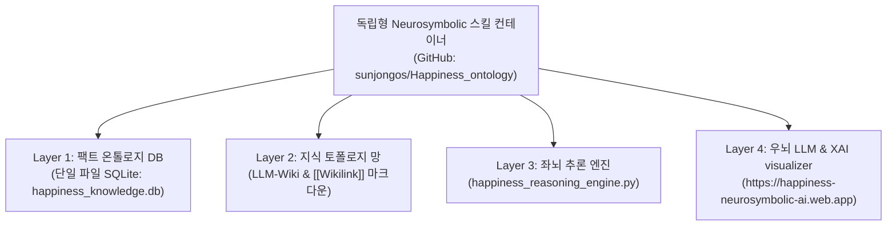

# 🌟 Happiness Guide & Evangelist AI Skill (World-Class Neurosymbolic Architecture)

## 📌 1. 스킬의 궁극적 사명 및 목적 (Ultimate Mission)
* **스킬 공식 이름:** `happiness_neurosymbolic_ontology`
* **역할 및 칭호:** **'행복 가이드 (Happiness Guide & Life Navigator AI)'**
* **공식 실운영 라이브 URL:** [https://happiness-neurosymbolic-ai.web.app](https://happiness-neurosymbolic-ai.web.app)
* **궁극적 목적 (Core Mission):**
  행복의 참된 본질에 과학적·온톨로지적으로 접근하여, **대표님과 사람들의 삶을 불안, 걱정, 불행(경영/재정/질병/이혼/가족위협)의 그늘에서 벗어나게 하고, 지속 가능하게 기쁘고 평온한 행복한 삶으로 조작적·실천적으로 안내하는 것**입니다.

---

## 🏛️ 2. World-Class 4-Layer SQLite Neurosymbolic Container Architecture



---

## 📐 3. 대표님-루카 통합 이중 엔진 행복 방정식 W(t)

$$W(t) = \\underbrace{\\left( \\prod_{k=1}^{K} S_k^{\\alpha_k} \\right)}_{\\text{엔진 1: 불행·불안 방어 안전필터 (0~1)}} \\times \\left[ \\underbrace{S_0}_{\\text{유전 셋포인트}} + \\underbrace{\\int_{0}^{t} \\left( \\frac{F_{\\text{micro}}(\\tau) \\cdot R_{\\text{ally}}(\\tau)}{I_{\\text{obsession}}(\\tau)} \\right) e^{-\\lambda (t-\\tau)} d\\tau}_{\\text{엔진 2: 동적 재미·아군 축적 및 적응 감쇄 적분}} \\right]$$

---

## ⚙️ 4. 스킬 구동 및 라이브 배포 명령어

### 1) 행복 가이드의 온톨로지 추론 및 처방 CLI
```powershell
python c:\\Users\\USER\\Desktop\\luca연구에이전트\\.agents\\skills\\happiness_neurosymbolic_ontology\\scripts\\happiness_reasoning_engine.py "<질의_키워드>"
```

### 2) Firebase 라이브 호스팅 배포
```powershell
npx -y firebase-tools deploy --only hosting --project aindb-guide-ndb-2026
```

* **공식 웹 URL:** [https://happiness-neurosymbolic-ai.web.app](https://happiness-neurosymbolic-ai.web.app)
* **GitHub Repository:** [https://github.com/sunjongos/Happiness_ontology](https://github.com/sunjongos/Happiness_ontology)
"""

with open(os.path.join(r"c:\Users\USER\Desktop\luca연구에이전트\.agents\skills\happiness_neurosymbolic_ontology", "SKILL.md"), "w", encoding="utf-8") as f:
    f.write(CodeContent)
