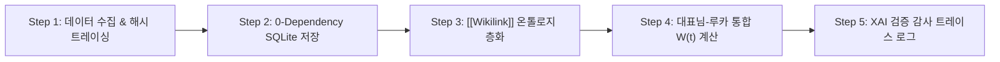

# 🧠 [LLM-Wiki Master Node] Neurosymbolic XAI 실시간 추론 시각화 대시보드 및 동적 이중 엔진 아키텍처

## 📌 1. 개요 (Overview)

본 노드는 대표님의 지시에 따라 구축된 **Explainable AI (XAI) 및 Responsible AI 5단계 파이프라인 시각화 대시보드 (`Neurosymbolic_XAI_Pipeline_Dashboard.html`)**의 기술 아키텍처와 추론 메커니즘을 정의합니다.

---

## 🛡️ 2. Responsible AI 5대 파이프라인 명세

1. **Step 01 - Data Ingestion**: Gemini 녹취, 유튜브 강연, PPTX, 논문 원천 URL 및 해시 매핑.
2. **Step 02 - SQLite Fact Storage**: 단일 파일 `happiness_knowledge.db` (8개 테이블) 무결성 보장.
3. **Step 03 - Semantic Ontology Layering**: 개념, 수식, 위키링크 간 토폴로지 자동 구성.
4. **Step 04 - W(t) Dual-Engine Evaluation**:
   * 엔진 1 (팔란티어 방어): $\prod S_k^{lpha_k}$ 0점 파국 감시.
   * 엔진 2 (재미 적분 공격): $\int F_{	ext{micro}} \cdot R_{	ext{ally}} e^{-\lambda t} dt$ 주파수 펄스 공급.
5. **Step 05 - XAI Audit & Prescription**: 환각 0% 검증 트레이스 터미널 로그 및 안전 처방 렌더링.

---

## 📂 3. 생성 파일 및 배포 위치

* **로컬 Dashboard HTML:** `c:\Users\USER\Desktop\luca연구에이전트\행복\Neurosymbolic_XAI_Pipeline_Dashboard.html`
* **Downloads 복사본:** `C:\Users\USER\Downloads\Neurosymbolic_XAI_Pipeline_Dashboard.html`
* **GitHub Repository:** [https://github.com/sunjongos/Happiness_ontology](https://github.com/sunjongos/Happiness_ontology)
