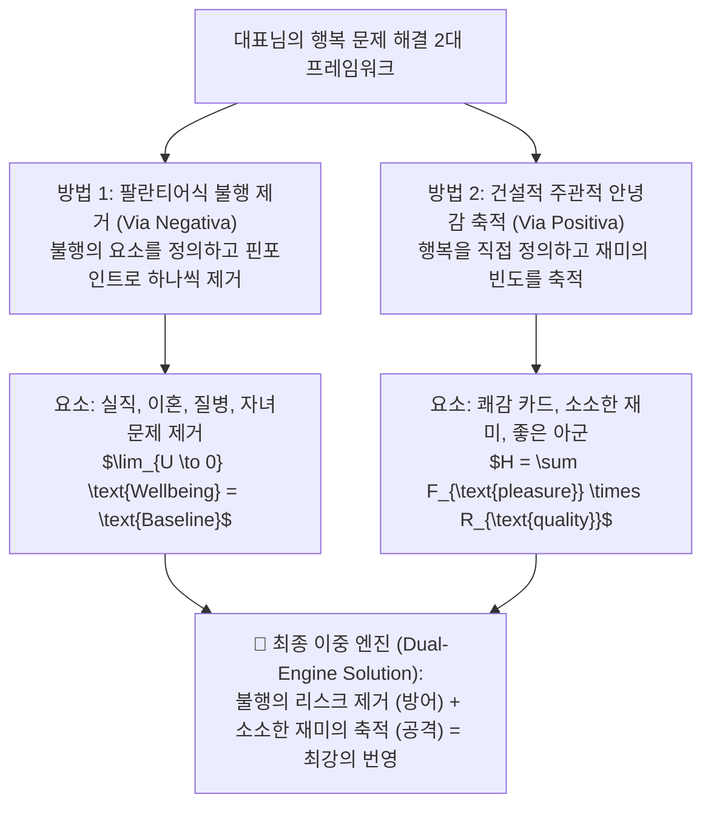
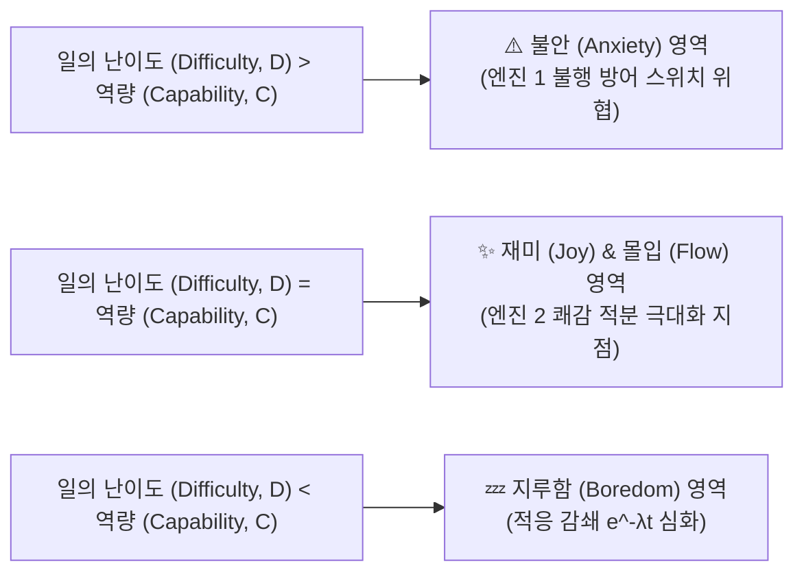
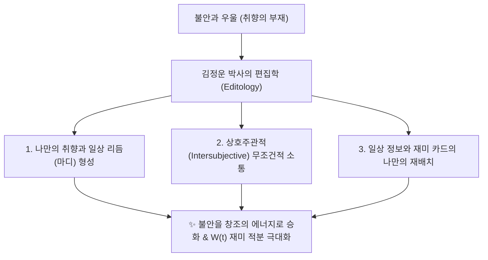

# 🧠 [LLM-Wiki Master Node] 대표님의 행복·불행 2대 해결 프레임워크 (Palantir Risk Elimination vs Positive Accumulation)

## 📌 1. 개요 (Executive Summary)

행복의 본질에 접근하여 문제를 해결하는 방법에는 대표님께서 제시하신 **두 가지 서로 보완적인 지혜로운 패러다임**이 존재합니다.

---

## 🛡️ 방법 1: 팔란티어식 불행 제거 모델 (Palantir Unhappiness Risk Elimination / Via Negativa)

### 1) 철학 및 전제
* 행복의 정의는 지극히 주관적이고 가변적이어서 명확히 수식화하기 어렵다는 전제에서 출발합니다.
* 대신 **객관적으로 측정 및 정의 가능한 '불행의 요소들($U$)'**을 먼저 규명하고, 시스템적으로 이 리스크 요소들을 하나씩 제거해 나감으로써 자연스럽게 행복에 도달합니다.

### 2) 불행의 4대 핵심 위협 요소 ($U_{\text{threats}}$)
1. **실직 및 경제적 붕괴 ($U_{\text{job}}$):** 생존의 기초 기반 위협
2. **이혼 및 관계 파국 ($U_{\text{divorce}}$):** 사회적 아군 해체 및 고립
3. **질병 및 신체적 통증 ($U_{\text{disease}}$):** 뇌신경계 스트레스 비상 신호
4. **자녀 및 가족의 심각한 문제 ($U_{\text{family}}$):** 진화론적 번식 자손에 대한 위협

### 3) 수리적 메커니즘
$$\text{Baseline State} = \text{Optimal Wellbeing} - \sum_{k} U_{k}$$
$$\text{If } \lim_{\sum U_k \to 0}, \quad \text{State} \longrightarrow \text{Optimal Wellbeing}$$

---

## 🚀 방법 2: 건설적 주관적 안녕감 & 재미 축적 모델 (Positive Accumulation / Via Positiva)

### 1) 철학 및 전제
* 행복을 직접 정의할 수 있다고 보며, 행복을 **'주관적 안녕감(Subjective Well-being)'**과 **'소소한 재미의 지속적 축적(Accumulation of Micro-Joys)'**으로 정밀 정의합니다.

### 2) 행복의 2대 구동 축 ($H_{\text{positive}}$)
1. **주관적 안녕감 (Subjective Well-being):** 타인과의 비교나 객관적 조건이 아닌, 스스로 삶에 대해 느끼는 전반적 인지적 만족도.
2. **재미의 축적 (Accumulation of Micro-Joys):** 큰 강도의 사건이 아니라 일상에서 경험하는 시시하고 사소한 즐거움 카드($F_{\text{pleasure}}$)의 빈도 쌓기.

### 3) 수리적 메커니즘
$$H = \text{SetPoint} + \sum_{t=1}^{N} F_{\text{pleasure}}(t) \times R_{\text{quality}}(t)$$

---

## ⚖️ 3. 루카의 최종 합성: 이중 엔진 양날개 전략 (Dual-Engine Neurosymbolic Framework)

대표님의 2대 접근법은 상호 배타적인 것이 아니라, **최상의 인생 경영 및 AGI 시스템을 작동시키는 '방어와 공격의 2대 이중 엔진'**입니다.

| 구분 | 방법 1: 팔란티어식 불행 제거 (방어) | 방법 2: 주관적 안녕감·재미 축적 (공격) |
| :--- | :--- | :--- |
| **관점** | 소극적·위험 관리적 접근 (Via Negativa) | 적극적·가치 창출적 접근 (Via Positiva) |
| **목표** | 불행의 요소($U$)를 0으로 수렴시킴 | 재미의 빈도($F$)와 주관적 만족도를 극대화함 |
| **핵심 솔루션** | 질병 치료, 경제 안정, 갈등 해결, 자녀 케어 | 맛있는 식사, 음악, 좋아하는 사람과의 수다 카드 |
| **역할** | **바닥을 받쳐주는 안심의 브레이크** | **위로 끌어올려 주는 희열의 가속 페달** |

> **💡 최종 결론:**
> 팔란티어식으로 불행의 구덩이(실직, 질병, 갈등)를 메워 **기반을 평평하게 다진 후(방어)**, 그 위에서 좋아하는 사람들과 소소한 재미를 매일 축적해 나갈 때(공격) 인간과 조직은 비로소 **최고의 생존과 번영**을 달성합니다.

---

## 🌀 칙센트미하이-대표님 몰입 & 재미(Flow & Joy) 역량 일치 매트릭스

행복은 일상에서 **소소한 재미(Joy)**를 계속 발굴해 나가는 과정입니다. 일상에서 Joy를 많이 찾을수록 $W(t)$의 적분 동력이 높아집니다.

### 📐 역량-난이도 균형 수식:
$$	ext{Joy}(D, C) = \exp \left( -rac{(D - C)^2}{2\sigma^2} 
ight) 	imes \min(D, C)$$
* **$C = 	ext{경험(Experience)} + 	ext{지식(Knowledge)} + 	ext{기술(Skill)}$**
* **역량($C$)과 과제 난이도($D$)가 절묘하게 만나는 골디락스 지점(Flow Zone)**에서 인간의 뇌는 도파민을 분비하며 최고의 재미와 지속 가능한 행복을 느낍니다.

---

## 🎨 김정운 박사의 편집학(Editology) & 취향(Taste)을 통한 재미(Joy) 창조

대표님께서 공유해주신 **NotebookLM 노트북 (`김정운의 소통 심리학`)** 연구 결과에 따르면:

### 📌 3대 핵심 편집학 온톨로지:
1. **창조는 편집이다 (Editology)**: 완전히 새로운 것은 없다. 일상의 쾌감 카드($F_{	ext{micro}}$)를 나만의 시각으로 편집하여 재배치하는 것이 삶의 재미다.
2. **취향이 없으면 우울하다**: 100억 아파트보다 시급한 것은 나만의 취향과 일상의 마디(Rhythm)다.
3. **상호주관적 소통 ($R_{	ext{ally}}$)**: 나를 있는 그대로 인정하는 아군과 상호주관적 공감을 나눌 때 불안이 완전 소멸한다.
