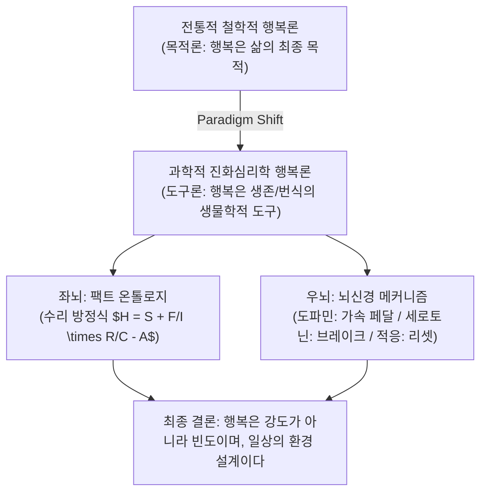

# 🧠 [LLM-Wiki Master Node] 서은국 교수의 《행복의 기원》 기반 뇌과학·진화심리학 및 수리적 행복 모델링

## 📌 1. 개요 및 패러다임 전환 (Paradigm Shift)

기존 인문학적·철학적 행복론은 행복을 "마음먹기에 달린 아리스토텔레스적 목적론(Teleology)"으로 정의해왔습니다. 그러나 연세대학교 심리학과 서은국 교수의 **진화심리학 및 뇌과학 연구**에 따르면, **행복은 삶의 궁극적 목적이 아니라 생존과 번식을 위해 뇌가 발명한 '생물학적 신호 기제(Signal System)'**에 불과합니다.

---

## 📐 2. 행복의 종합 수리 방정식 (Comprehensive Mathematical Models)

### 모델 1: 행복 종합 구동 방정식 ($H$)
$$\text{Happiness} (H) = S + \left( \frac{F_{\text{pleasure}}}{I_{\text{pleasure}}} \right) \times \left( \frac{R_{\text{quality}}}{C_{\text{isolation}}} \right) - A_{\text{adaptation}}$$

* **$S$ (Set Point, 유전적 외향성):** 행복감 차이의 40~50%를 좌우하는 선천적 유전 기준점.
* **$F_{\text{pleasure}} / I_{\text{pleasure}}$ (강도 대비 빈도비):** 소소한 즐거움의 경험 빈도($F$)가 분자, 거창한 성취의 강도($I$)가 분모. 강도에 집착할수록 분모가 커져 효용 감소.
* **$R_{\text{quality}} / C_{\text{isolation}}$ (고립 대비 아군 관계비):** 양질의 무조건적 아군 관계($R$)가 분자, 사회적 고립($C$)이 분모. 고립도가 높을수록 뇌는 심각한 위험 신호를 발화함.
* **$A_{\text{adaptation}}$ (정서적 적응 차감량):** 뇌가 새로운 자극 감지를 위해 감정을 '0'으로 빠르게 초기화시키는 리셋 차감 요인.

---

### 모델 2: 표현형 분산 분해 공식 ($V_P$)
행복감의 개인차($V_P$)에 관한 행동유전학 수리식:
$$V_P = V_G + V_E + 2\text{Cov}(G, E) + V_{G \times E} + e$$

실증 데이터 기준 변산 분해:
$$V_P = \underbrace{V_G (\text{유전적 외향성})}_{\approx 50\%} + \underbrace{V_{\text{Chance}} (\text{살면서 겪는 우연})}_{\approx 45\%} + \underbrace{V_{\text{Effort}} (\text{의지/마음먹기})}_{< 5\%}$$

> **Key Takeaway:** "행복해지겠다"는 주관적 의지나 마음먹기($V_{\text{Effort}}$)는 행복 개인차의 5% 미만에 불과하며, **우연히 즐거운 자극과 좋은 사람을 만날 수 있는 환경 설계**가 결정적입니다.

---

## 🧬 3. 뇌신경조절물질 (Neuromodulators)과 생물학적 작용 기전

| 물질/현상 | 메커니즘 비유 | 생물학적 기능 및 역할 | 행복과의 연관성 |
| :--- | :--- | :--- | :--- |
| **도파민 (Dopamine)** | **가속 페달** | 탐색 및 기대치 않은 보상(Unpredicted Reward) 시 폭발 분비 | 희망, 욕구, 추구의 동기 부여 |
| **세로토닌 (Serotonin)** | **안정 브레이크** | 안심할 수 있는 아군 집단 수용감 및 만족감 제공 | 과도한 불안·욕망 조절, 평온 유지 |
| **정서적 적응 (Adaptation)** | **자동 리셋** | 감정 신호를 빠르게 '0'으로 초기화시킴 | 물질/성취의 행복 지속 시간을 제약함 |

---

## 👥 4. 호모 사피엔스의 초사회성 (Ultra-sociality)과 양질의 아군

* **초사회성(Ultra-sociality):** 호모 사피엔스가 신체적 약점에도 불구하고 지구를 정복한 원동력은 '혈연을 넘어선 대규모 상호협력'에 있었습니다.
* **뇌의 사람 반응 기제:** 인간의 뇌는 '사람(양질의 아군)'과 함께할 때 도파민과 세로토닌 전구를 가장 안정적으로 구동합니다.
* **고립의 치명성:** 사회적 고립은 뇌에게 생존 위협 신호로 작동하며, 65세 이상 연령층에서 **고립은 흡연·음주·비만보다 사망 위험에 더 치명적**입니다.

---

## 🔗 5. 온톨로지 연관 위키 노드 (Wiki Relations)

* [[행복은_과학입니다_PPTX_비교분석_보고서]]
* [[행복은_과학입니다_Gemini_공유대화_녹취록]]
* [[서은국_행복의기원_진화심리학_노트]]
* [[happiness_knowledge_db_schema]]
